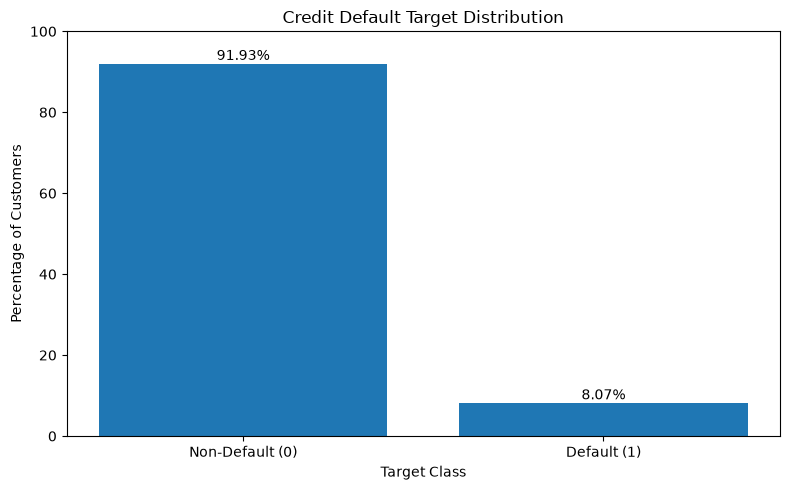
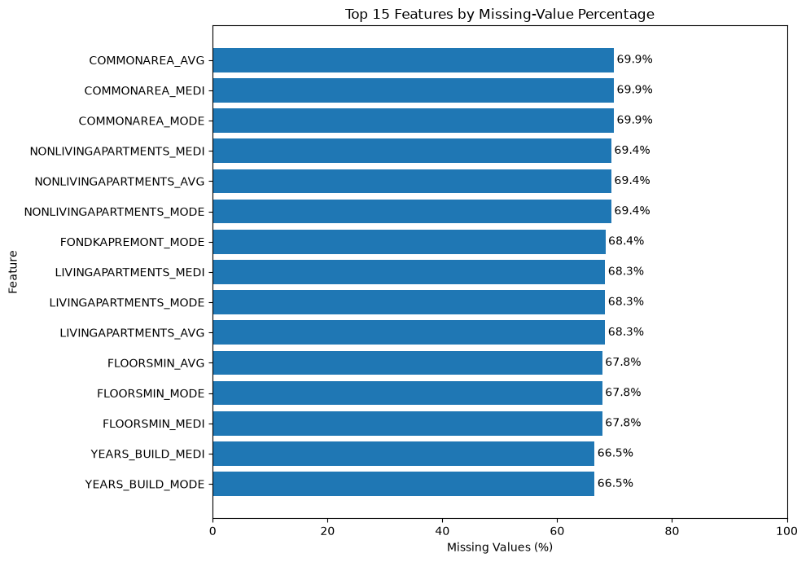
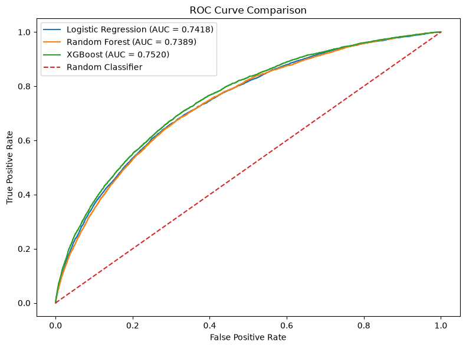
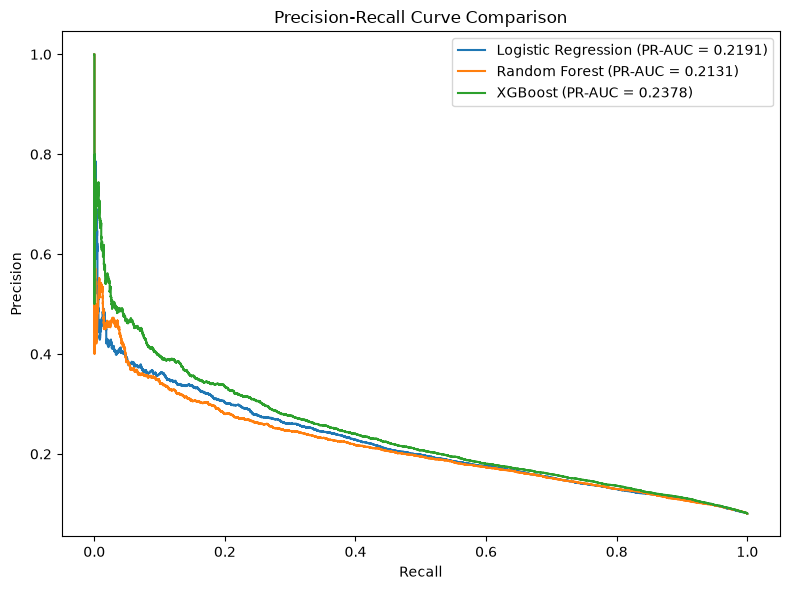
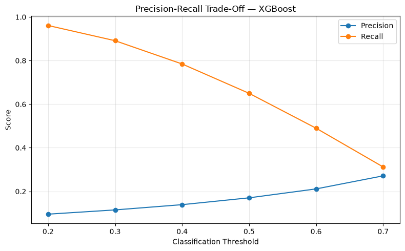
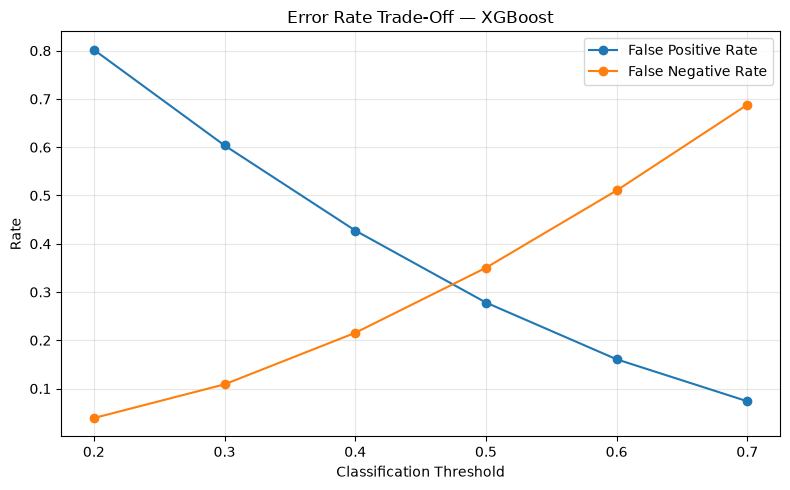
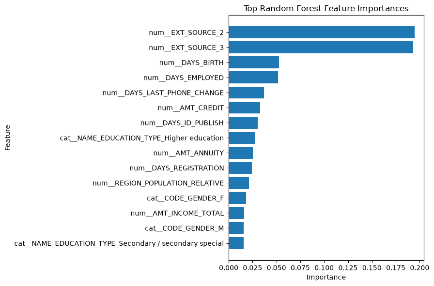
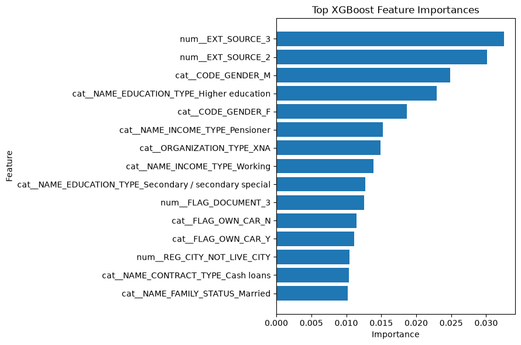

## About the Author

**Divyansh Sahai** is an economics postgraduate with a strong interest in data science, machine learning, financial analytics, and quantitative research. He developed this project to apply machine learning and scalable data-processing techniques to a practical credit-risk problem, with an emphasis on end-to-end pipeline development, model evaluation, risk segmentation, monitoring, and stress testing.

## 1. Project Overview

This project develops an end-to-end credit risk machine learning pipeline for predicting customer default risk and supporting risk-based decision-making. The pipeline covers large-scale data processing with PySpark, data quality assessment, preprocessing, feature engineering, model development, model evaluation, threshold optimization, customer risk segmentation, model monitoring, and stress testing.

The project evaluates multiple classification models, selects the best-performing model based on multiple evaluation metrics, and extends the analysis beyond prediction to provide interpretable customer risk segments and scenario-based credit risk analysis.

## 2. Business Problem

Credit risk modelling involves identifying customers who are more likely to default while balancing the cost of missed defaults against unnecessary interventions on lower-risk customers.

The objective of this project is to build a data-driven framework that estimates default probability, evaluates classification performance across different decision thresholds, segments customers based on financial and credit-risk characteristics, and assesses how predicted risk changes under stressed scenarios.

The pipeline is designed to demonstrate how machine learning can support credit-risk assessment throughout the broader modelling lifecycle rather than treating model training as an isolated task.

## 3. Project Objectives

The project aims to:

- Build a scalable credit-risk data processing pipeline using PySpark.
- Perform data-quality assessment, cleaning, and preprocessing.
- Engineer and select features relevant to customer default prediction.
- Develop and compare multiple machine learning classification models.
- Evaluate models using ROC-AUC, PR-AUC, precision, recall, and F1-score.
- Optimize the classification threshold based on precision-recall trade-offs.
- Segment customers using unsupervised learning and evaluate cluster quality.
- Analyze model feature importance to improve interpretability.
- Establish monitoring outputs for data, prediction, and risk-segment behaviour.
- Perform baseline, moderate-stress, and severe-stress scenario analysis.
- Produce reproducible outputs, evaluation reports, and visualizations.

## 4. Dataset

The project uses a large-scale credit-risk dataset containing **307,511 customer records** and **71 initial features**. The dataset contains customer-level financial, demographic, credit, and application-related variables used to assess default risk.

The data is processed through the pipeline before modelling, resulting in **179 processed features** after preprocessing and feature engineering. The dataset is divided into **246,008 training customers** and **61,503 test customers**.

The original raw dataset is retained separately from the processed modelling data to maintain a clear distinction between source data and model-ready features.

## 5. Technology Stack

- **Python** — Core programming language and pipeline implementation
- **PySpark** — Large-scale data processing and transformation
- **Pandas & NumPy** — Data manipulation and numerical computation
- **Matplotlib** — Data visualization and model-analysis plots
- **Scikit-learn** — Preprocessing, model development, evaluation, clustering, and metrics
- **XGBoost** — Gradient-boosted tree classification
- **MLflow** — Experiment tracking and model comparison
- **Jupyter Notebook** — Development, execution, and documentation
- **Git & GitHub** — Version control and project repository management

## 6. End-to-End ML Pipeline

The project follows an end-to-end machine learning workflow:

**Data Ingestion → Data Quality Assessment → Data Cleaning → Preprocessing → Feature Engineering → Train/Test Split → Model Development → Model Evaluation → Threshold Optimization → Risk Segmentation → Explainability → Monitoring → Stress Testing → Final Reporting**

The pipeline combines scalable data processing with supervised and unsupervised machine learning components to evaluate both individual default risk and broader customer risk patterns.

## 7. Data Ingestion and Validation

The pipeline begins by ingesting the raw credit-risk dataset and validating the project structure and input data before downstream processing.

Initial validation includes:

- Dataset shape and schema inspection
- Feature and data-type identification
- Missing-value assessment
- Duplicate-record detection
- Numerical and categorical variable inspection
- Target-variable validation
- Basic data-quality checks

These checks establish the initial data-quality baseline and provide the foundation for subsequent cleaning and feature engineering.


## 8. Exploratory Data Analysis

Exploratory analysis was performed to understand the distribution of the target variable, identify missing-data patterns, examine customer characteristics, and investigate relationships between financial variables and default behaviour.

The analysis includes:

- Target/default distribution
- Missing-value analysis
- Default rates across categorical customer characteristics
- Numerical feature distributions
- Correlation analysis among numerical features
- Identification of potential relationships between customer characteristics and default risk

The findings from exploratory analysis were used to guide subsequent preprocessing and feature-engineering decisions.

## 9. Data Cleaning and Preprocessing

The raw dataset was transformed into a model-ready dataset through a structured preprocessing workflow.

Key steps included:

- Handling missing values
- Removing duplicate records
- Processing numerical and categorical variables
- Encoding categorical features
- Applying appropriate feature transformations
- Preparing consistent train and test feature representations
- Saving the fitted preprocessing component for reuse

The preprocessing workflow increased the modelling feature space from **71 initial features to 179 processed features** while maintaining a consistent transformation process between training and testing data.

## 10. Feature Engineering

Feature engineering was performed to transform the available customer and financial variables into a modelling-ready representation that captures relationships relevant to credit risk.

The feature-engineering workflow focuses on:

- Financial and customer-level derived variables
- Credit and income relationships
- Debt and payment-burden relationships
- Aggregated risk indicators
- Numerical transformations
- Interaction and ratio-based features
- Consistent feature generation across training and test data

The resulting feature set was incorporated into the preprocessing pipeline, increasing the modelling representation from **71 initial features to 179 processed features**.

## 11. Model Development

Three classification models were developed and evaluated for customer default prediction:

1. **Logistic Regression** — baseline linear classification model
2. **Random Forest** — tree-based ensemble model
3. **XGBoost** — gradient-boosting model

The models were trained using the processed feature set and evaluated on a held-out test dataset containing **61,503 customers**.

Model development focused on comparing predictive performance across multiple evaluation metrics rather than relying on accuracy alone.

## 12. Model Evaluation and Comparison

Model performance was evaluated using metrics appropriate for an imbalanced credit-risk classification problem:

- ROC-AUC
- PR-AUC
- Precision
- Recall
- F1-score
- Confusion matrices
- ROC curves
- Precision-Recall curves

### Model Performance

| Model | ROC-AUC | PR-AUC | Precision | Recall | F1-Score |
|---|---:|---:|---:|---:|---:|
| **XGBoost** | **0.7520** | **0.2378** | **0.1702** | **0.6497** | **0.2697** |
| Logistic Regression | 0.7418 | 0.2191 | 0.1590 | **0.6705** | 0.2571 |
| Random Forest | 0.7389 | 0.2131 | 0.1679 | 0.6286 | 0.2650 |

**XGBoost** achieved the strongest overall performance, recording the highest ROC-AUC, PR-AUC, and F1-score among the evaluated models. It was therefore selected as the final model for downstream risk analysis.

## 13. Classification Threshold Optimization

A default classification threshold of 0.50 was not assumed to be optimal. Multiple probability thresholds from **0.20 to 0.70** were evaluated to understand the trade-off between precision, recall, false-positive rate, and false-negative rate.

The threshold of **0.60** produced the highest F1-score among the evaluated thresholds:

- **Precision:** 0.2113
- **Recall:** 0.4896
- **F1-score:** 0.2950
- **False Positive Rate:** 0.1607
- **False Negative Rate:** 0.5104

The **0.60 threshold** was therefore selected as the recommended operating threshold for the final risk classification analysis.

## 14. Customer Risk Segmentation

An unsupervised clustering component was added to identify distinct customer risk profiles based on financial and credit-related characteristics.

Multiple K-Means configurations were evaluated using silhouette score:

| Number of Clusters | Silhouette Score |
|---:|---:|
| **2** | **0.5065** |
| 3 | 0.4178 |
| 4 | 0.3807 |
| 5 | 0.3810 |
| 6 | 0.3826 |

The **2-cluster solution** produced the strongest silhouette score and was selected for customer segmentation.

### Segment Profiles

| Cluster | Customers | Default Rate | Avg. Income | Avg. Credit | Avg. Annuity |
|---:|---:|---:|---:|---:|---:|
| 0 | 79,028 | 6.85% | 222,189 | 1,049,098 | 42,824 |
| 1 | 166,980 | **8.65%** | 143,611 | 386,482 | 19,670 |

Cluster 1 represents the comparatively higher-risk segment, with a higher observed default rate and substantially lower average income, credit amount, and annuity than Cluster 0.

## 15. Model Explainability and Feature Importance

Feature-importance analysis was performed to understand which variables contributed most strongly to the predictions generated by the tree-based models.

Feature importance was examined for both **Random Forest** and **XGBoost**, with the top predictive features visualized for interpretation.

This analysis provides greater transparency into the model's decision-making process and helps identify the financial and customer characteristics most associated with predicted credit risk.

## 16. Model Monitoring

A monitoring framework was incorporated to assess changes in model-related outputs and risk characteristics over time.

The monitoring workflow considers:

- Data-quality changes
- Missing-value patterns
- Feature distribution changes
- Prediction distribution changes
- Risk-segment distribution
- Model-performance metrics when actual outcomes are available

Monitoring is intended to support ongoing assessment of model behaviour and identify potential changes that may require further investigation or model review.

## 17. Stress Testing

Scenario-based stress testing was performed to evaluate how predicted credit risk changes under progressively adverse conditions.

Three scenarios were evaluated:

- **Baseline**
- **Moderate Stress**
- **Severe Stress**

| Scenario | Avg. Default Probability | Median Default Probability | High-Risk % |
|---|---:|---:|---:|
| Baseline | 0.3981 | 0.3729 | 18.72% |
| Moderate Stress | 0.4008 | 0.3760 | 19.11% |
| Severe Stress | 0.4047 | 0.3807 | 19.50% |

The results show a gradual increase in predicted default probability and the proportion of customers classified as high risk as stress severity increases.

## 18. Key Results

| Metric | Result |
|---|---:|
| Customer Records | **307,511** |
| Initial Features | **71** |
| Processed Features | **179** |
| Training Customers | **246,008** |
| Test Customers | **61,503** |
| Best Model | **XGBoost** |
| ROC-AUC | **0.7520** |
| PR-AUC | **0.2378** |
| Recommended Threshold | **0.60** |
| Optimal Number of Clusters | **2** |
| Silhouette Score | **0.5065** |

The project combines predictive modelling with threshold optimization, customer segmentation, explainability, monitoring, and stress testing to provide a broader credit-risk analysis framework.

## 19. Key Business Insights

- **XGBoost provided the strongest overall predictive performance**, achieving the highest ROC-AUC, PR-AUC, and F1-score among the evaluated models.
- **Threshold selection materially affects risk classification outcomes.** A threshold of 0.60 produced the highest F1-score among the evaluated thresholds.
- **Customer segmentation identified meaningful differences in observed default behaviour.** Cluster 1 had a higher default rate of 8.65% compared with 6.85% for Cluster 0.
- **Risk characteristics changed under stress scenarios**, with average predicted default probability increasing from 0.3981 under baseline conditions to 0.4047 under severe stress.
- **The modelling framework extends beyond default prediction** by incorporating segmentation, explainability, monitoring, and scenario-based stress analysis.

## 20. Project Structure

```text
credit-risk-ml-pipeline/
│
├── data/
│   ├── raw/
│   └── processed/
│
├── models/
│   └── preprocessor.pkl
│
├── notebooks/
│   └── credit_risk_ml_pipeline.ipynb
│
├── reports/
│   ├── figures/
│   └── *.csv
│
├── .env.example
├── .gitignore
├── README.md
└── requirements.txt
```

## 21. Installation and Environment Setup

### Prerequisites

Ensure the following are installed before running the project:

- Python 3.11
- Anaconda or Miniconda
- Jupyter Notebook or JupyterLab
- Java Runtime Environment compatible with PySpark
- Git

### Clone the Repository

```bash
git clone https://github.com/divyansh-sahai/Credit-Risk-ML-Pipeline.git
cd Credit-Risk-ML-Pipeline
```

## 22. How to Run the Project

1. Clone the repository and navigate to the project directory.
2. Create and activate the Python environment described in the installation section.
3. Install the dependencies from `requirements.txt`.
4. Place the required raw dataset in `data/raw/`.
5. Open `notebooks/credit_risk_ml_pipeline.ipynb` in Jupyter Notebook or JupyterLab.
6. Run the notebook sequentially through the labelled pipeline stages.
7. Review the generated results in `reports/`, including model evaluation, threshold analysis, customer segmentation, stress testing, and visualization outputs.

The notebook contains the complete analytical workflow, while generated reports and figures are stored separately in the `reports/` directory.

## 23. Outputs and Reports

The `reports/` directory contains the primary analytical outputs generated by the pipeline, including:

- Final project results summary
- Model evaluation results
- Risk-threshold analysis
- Cluster evaluation results
- Risk-segment profiles
- Stress-test results
- Model-analysis outputs
- Generated visualizations

These outputs provide reproducible evidence supporting the model-selection, threshold-optimization, segmentation, and stress-testing conclusions presented in this README.

## 24. Visualizations

The project includes **8 generated figures** covering exploratory analysis, model evaluation, threshold analysis, and feature importance.

### Target and Data Analysis





### Model Evaluation





### Threshold Optimization





### Feature Importance





## 25. Reproducibility

The project is structured to support reproducible analysis and model development.

Key practices include:

- Fixed train/test split
- Consistent preprocessing workflow
- Saved preprocessing artifact for reuse
- Dependency management through `requirements.txt`
- Version-controlled source code and project outputs
- Separate raw and processed data directories
- Saved model-evaluation and risk-analysis results
- Saved visualization outputs
- MLflow-based experiment tracking
- Consistent feature-processing workflow

The complete analytical workflow is contained in the main project notebook and is organized into clearly labelled stages from data preparation through final risk analysis.

## 26. Limitations

- The analysis is based on a historical credit-risk dataset and does not represent live production credit data.
- Stress-testing scenarios are simulated and should not be interpreted as forecasts of actual economic conditions.
- Model performance may vary when applied to a different population, time period, or lending environment.
- The selected classification threshold is based on the evaluated modelling objective and may require recalibration for a specific business cost structure.
- Customer clusters represent statistical groupings based on the selected features and should not be interpreted as causal risk categories.
- Model predictions should support, rather than replace, appropriate human review and risk-management controls.

## 27. Future Improvements

Potential extensions to the project include:

- Deploying the PySpark pipeline to a managed distributed environment such as Databricks.
- Integrating a production-grade model registry and model-serving workflow.
- Automating data-quality and prediction-drift monitoring.
- Implementing scheduled model retraining and performance tracking.
- Expanding hyperparameter optimization and cross-validation.
- Adding probability calibration for improved interpretation of predicted default probabilities.
- Incorporating SHAP-based global and individual-level explanations.
- Expanding fairness analysis across relevant customer groups.
- Incorporating additional economic variables into stress-testing scenarios.
- Adding automated testing and CI/CD workflows.

## 28. Conclusion

This project demonstrates an end-to-end credit-risk machine learning workflow, covering data processing, preprocessing, feature engineering, predictive modelling, model evaluation, threshold optimization, customer segmentation, model explainability, monitoring, and stress testing.

Among the evaluated models, XGBoost achieved the strongest overall performance with a **ROC-AUC of 0.7520**, **PR-AUC of 0.2378**, and **F1-score of 0.2697**. Threshold analysis identified **0.60** as the strongest evaluated operating threshold based on F1-score.

The project further extends predictive modelling into practical risk analysis through customer segmentation and scenario-based stress testing, providing a broader framework for analysing and interpreting customer credit risk.


